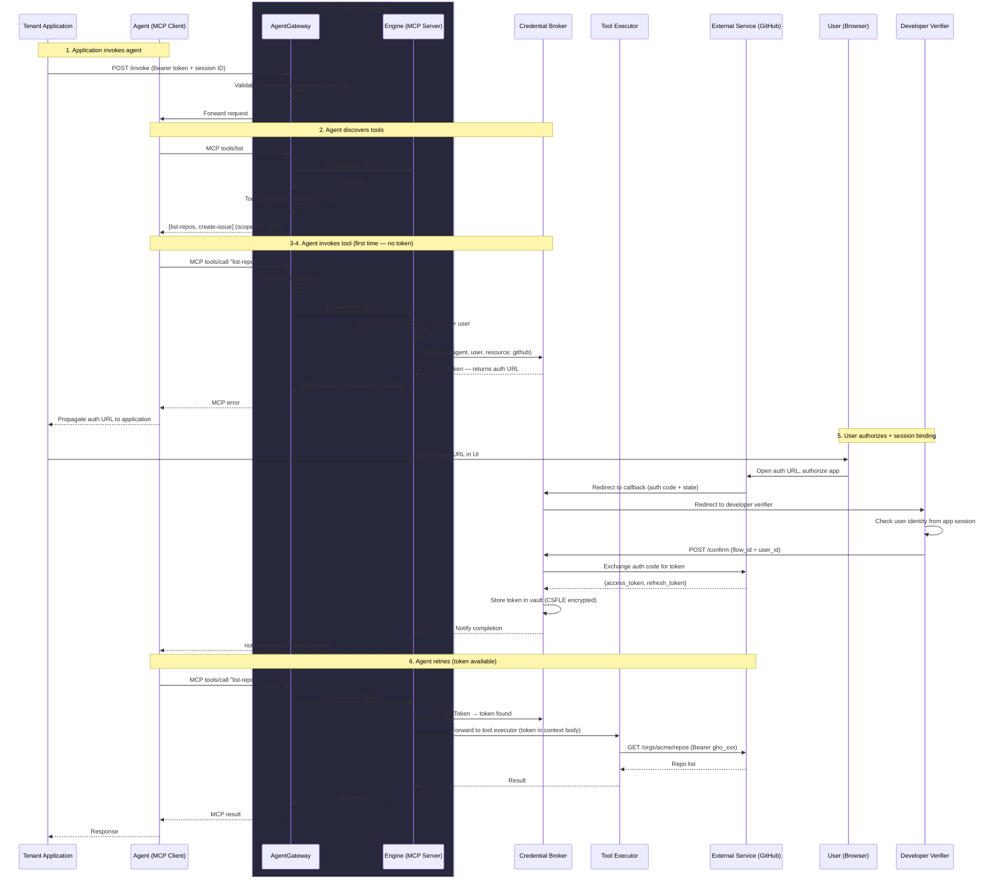

# Agent Identity & Delegated Access for Magenta

# Overview

This document outlines an architecture for Magenta to support **agents acting on behalf of authenticated users** to access external services (GitHub, Jira, Google Calendar, etc.) via Three-Legged OAuth (3LO). It describes how the per-tenant gateway, the engine (sidecar), and the credential broker work together to handle delegated access — using the MCP [URL mode elicitation](https://modelcontextprotocol.io/specification/draft/client/elicitation#url-mode-elicitation-for-oauth-flows) protocol as the standard mechanism for triggering and completing OAuth flows.

---

# Background

## The core problem: agents acting on behalf of users

When an AI agent needs to access an external service (GitHub, Jira, Google Calendar) on behalf of a user, several hard problems arise:

1. **Identity resolution** — the system needs to know *which agent* is making the request and *which user* it's acting for, without the agent being able to forge this context
2. **Credential management** — OAuth tokens must be acquired, stored, refreshed, and injected without the agent ever seeing them (agents run untrusted code)
3. **Session binding** — when a user authorizes an OAuth flow, the system must verify that the user who completed the authorization is the same user whose agent initiated it (prevents confused-deputy attacks)
4. **Standard protocol** — the mechanism for triggering and completing authorization flows should be a standard protocol, not a custom API that every client needs to implement

## Why Magenta's architecture is better positioned

Existing approaches like [AgentCore's 3LO flow](?tab=t.0) solve these problems through explicit multi-step protocols: the agent calls `GetWorkloadAccessToken`, then `GetResourceOAuth2Token`, the developer manages a session binding callback, and authentication is handled by IAM (SigV4). This complexity exists because **AgentCore agents can be self-hosted backends with no guarantee of a central mediator in the request path** — the agent might bypass the Runtime entirely, so every step must be explicitly secured.

**Magenta's architecture is fundamentally different.** All agent traffic flows through a **central, per-tenant mediator** that the agent cannot bypass (enforced by DNS redirection and network policy). This gives us a property that AgentCore doesn't have: **the mediator can infer the full request context (which agent, which session, which user) from the request itself**, without the agent needing to propagate anything. See [How the Gateway Resolves Agent + User Context](#how-the-gateway-resolves-agent--user-context) for details.

This means:

- The agent **never needs to see the user's access token or userId** — the mediator resolves the user from its own state
- The agent **never needs to call a `GetWorkloadAccessToken` equivalent** — the mediator knows the (agent + user) pair from the source pod identity and session state
- The agent **only needs to invoke tools via MCP** — credential injection is completely transparent
- **JWT validation happens once, at the mediator** — there is no need for a second validation layer (unlike AgentCore's [zero-trust two-layer model](https://docs.google.com/document/d/1uUDODvJlO0rCH7BwgYXv9KTifMQJY9yoq91PBQ6PxXM/edit?tab=t.0#heading=h.gktmkuu5jrx), which exists because self-hosted agents can bypass the Runtime)

## MCP Elicitation: a standard protocol for delegated access

The MCP specification recently introduced [Elicitation](https://modelcontextprotocol.io/specification/draft/client/elicitation) — a protocol for MCP servers to request information or authorization from users through the client. Its [URL mode for OAuth flows](https://modelcontextprotocol.io/specification/draft/client/elicitation#url-mode-elicitation-for-oauth-flows) directly addresses problem (4) above: it defines a standard way for an MCP server to trigger a third-party OAuth flow, with built-in [session binding / anti-phishing requirements](https://modelcontextprotocol.io/specification/draft/client/elicitation#phishing), [completion notifications](https://modelcontextprotocol.io/specification/draft/client/elicitation#completion-notifications-for-url-mode-elicitation), and a [standard error code](https://modelcontextprotocol.io/specification/draft/client/elicitation#url-elicitation-required-error) (`URLElicitationRequiredError`, `-32042`) that any MCP-compliant client already knows how to handle.

Magenta adopts elicitation as the standard protocol for all delegated access flows — enabling any MCP-compliant client to participate in authorization flows without platform-specific integration.

## Comparison with AgentCore

| Concern | AgentCore | Magenta |
| :---- | :---- | :---- |
| Identity resolution | Agent calls `GetWorkloadAccessToken` explicitly | **Automatic.** Mediator resolves (agent, user) from pod identity + session state |
| Credential request | Agent calls `GetResourceOAuth2Token` | **Transparent.** Engine calls credential broker on each tool invocation; agent never calls a token endpoint |
| Auth trigger | Custom API, requires agent-side handling | **Standard.** MCP [URL elicitation](https://modelcontextprotocol.io/specification/draft/client/elicitation#url-mode-elicitation-requests) — any compliant client handles it |
| Session binding | Developer-managed callback calls `CompleteResourceTokenAuth` | Credential broker verifies user identity at the callback stage, following the [elicitation spec's requirements](https://modelcontextprotocol.io/specification/draft/client/elicitation#phishing). See [Session Binding Approaches](#session-binding-approaches) |
| Completion signal | Custom polling / retry | **Standard.** [`notifications/elicitation/complete`](https://modelcontextprotocol.io/specification/draft/client/elicitation#completion-notifications-for-url-mode-elicitation) tells the client when to retry |
| Inbound auth | JWT validation + defense-in-depth re-validation (because agents can bypass Runtime) | JWT validation **once** at the mediator (agents can't bypass it) |
| Application auth | AWS IAM (SigV4) only | Multiple options: [MCP Authorization](https://modelcontextprotocol.io/specification/draft/basic/authorization) (OAuth 2.1), API key, or JWT bearer — AgentGateway supports all natively |

---

# Architecture

## Components

This architecture splits responsibilities across three components:

- **Per-tenant gateway (AgentGateway)** — inbound auth (JWT validation), agent/user identity resolution ([Workload Discovery](https://github.com/agentgateway/agentgateway/blob/2eef33671bbf123135a4d0007cf48e92d7077d3b/crates/agentgateway/src/types/discovery.rs#L204) + session state), MCP-native tool-call authorization, and routing to the engine. Leverages AgentGateway's [JWT validation](https://agentgateway.dev/docs/kubernetes/latest/security/jwt/setup/), [native MCP backend support](https://agentgateway.dev/docs/kubernetes/latest/reference/api/#agentgatewaybackend), and [CEL-based policy evaluation engine](https://agentgateway.dev/docs/kubernetes/latest/reference/cel/) (including [MCP-layer authorization](https://agentgateway.dev/docs/kubernetes/latest/mcp/tool-access/) via `mcp.tool.name`).
- **Engine (sidecar)** — runs as a sidecar container on the same pod as AgentGateway, communicating over a [**Unix domain socket**](https://github.com/agentgateway/agentgateway/blob/96dc02f9dc4fb6569fdac115f40b79ab0656292e/examples/tailscale-auth/config.yaml#L20). Serves as the MCP server backend and session resolver. On tool invocations, resolves request context (pod IP → session → user) and calls the credential broker over internal RPC to fetch tokens. The engine never sees client secrets, auth codes, or KMS keys — it just requests tokens on demand. When a token is unavailable, it uses the standard MCP [URL mode elicitation](https://modelcontextprotocol.io/specification/draft/client/elicitation#url-mode-elicitation-for-oauth-flows) protocol to direct the user to authorize.
- **Credential broker** — a shared service that owns the full OAuth lifecycle: provider registrations, OAuth callbacks, authorization code exchange, session binding, token storage/refresh, and per-tenant encryption. Exposes both **internal RPC** (engine → fetch tokens) and **public-facing HTTP endpoints** (OAuth callbacks from external providers, connect/confirm endpoints for session binding). Backed by MongoDB with [Client-Side Field Level Encryption (CSFLE)](https://www.mongodb.com/docs/manual/core/csfle/) using per-tenant KMS keys.

The gateway routes MCP traffic to the engine via a native `AgentgatewayBackend` (MCP type, UDS transport). The engine maintains an in-memory cache of the agentic operator's pod-to-session mapping and handles tool execution. For credential injection, the engine calls the credential broker — which either returns a valid token or indicates that authorization is required.

## Two auth layers

There are two distinct auth boundaries in this architecture, both standardized by the MCP specification:

| Layer | What it does | MCP spec | Who handles it |
| :---- | :---- | :---- | :---- |
| **Inbound auth** | Authenticates the end user's request and establishes the session that identifies (agent, user) | [MCP Authorization](https://modelcontextprotocol.io/specification/draft/basic/authorization) (OAuth 2.1) | Gateway (JWT validation on external listener) |
| **Third-party auth** | Obtains OAuth tokens from external services (GitHub, Jira, etc.) on behalf of the user | [MCP Elicitation — URL mode for OAuth](https://modelcontextprotocol.io/specification/draft/client/elicitation#url-mode-elicitation-for-oauth-flows) | Engine (triggers elicitation) + Credential broker (handles OAuth + [session binding](#appendix-session-binding-approaches)) |

The inbound auth layer validates the user's access token and establishes the session context that the engine uses to resolve (agent, user) on every request. The elicitation layer handles third-party credential acquisition — a standard protocol that any MCP-compliant client already knows how to handle. These two layers are independent: the user's inbound token is never forwarded to external services (see the elicitation spec's [token passthrough prohibition](https://modelcontextprotocol.io/specification/draft/client/elicitation#url-mode-elicitation-for-oauth-flows)).

---

# Common Setup

Before the runtime flow can work, several pieces of configuration are needed.

## 1. Inbound authentication

The tenant configures which IdP their users authenticate with — providing the issuer, JWKS endpoint, and allowed audiences. The platform configures AgentGateway's [JWT validation policy](https://agentgateway.dev/docs/kubernetes/latest/security/jwt/setup/) on the tenant's gateway.

Example of the generated AgentGateway JWT policy:

```yaml
apiVersion: agentgateway.dev/v1alpha1
kind: AgentgatewayPolicy
metadata:
  name: user-jwt-auth
  namespace: tenant-a
spec:
  targetRefs:
  - group: gateway.networking.k8s.io
    kind: Gateway
    name: tenant-gateway
  traffic:
    jwtAuthentication:
      mode: Strict
      providers:
      - issuer: "https://accounts.google.com"
        audiences: ["magenta-tenant-a"]
        allowedClients: ["<client-id-from-idp>"]
        allowedScopes: ["openid", "profile"]
        jwks:
          remote:
            jwksPath: "/oauth2/v3/certs"
            cacheDuration: "5m"
            backendRef:
              kind: Service
              name: google-jwks
              port: 443
```

The `backendRef` references a K8s Service that resolves to the IdP's JWKS endpoint:

```yaml
apiVersion: v1
kind: Service
metadata:
  name: google-jwks
  namespace: tenant-a
spec:
  type: ExternalName
  externalName: www.googleapis.com
```

## 2. External resource registration

For each external service agents will access on behalf of users (GitHub, Google Calendar, Jira, etc.), the tenant admin registers a **credential provider** — an OAuth app registration that the credential broker uses to broker delegated access:

1. Create an OAuth app on the external service (e.g., GitHub Developer Settings) — gets a client ID and secret
2. Register it as a credential provider via the Magenta API (providing the client ID, client secret, and provider endpoints) — the platform returns a provider-facing callback URL (routed to the credential broker)
3. Register that callback URL in the external service's OAuth app settings

Example API call:

```json
POST /api/v1/projects/tenant-a/credential-providers
{
  "name": "github",
  "type": "oauth2",
  "clientId": "Iv1.abc123",
  "clientSecret": "...",
  "authorizationEndpoint": "https://github.com/login/oauth/authorize",
  "tokenEndpoint": "https://github.com/login/oauth/access_token"
}
```

The credential provider definition does not include scopes — scopes are declared per tool in the [tool manifest](#tool-manifests-with-resource-bindings), since different tools may need different scopes from the same resource.

## 3. Developer-managed verifier endpoint

The developer configures and deploys a verifier endpoint that handles [session binding](#session-binding-approaches) — confirming the user who completed the OAuth flow is the same user whose agent initiated it. The verifier URL is configured per project. After a user completes an OAuth authorization, the credential broker redirects to this verifier; the verifier confirms the user's identity from the application's own session and calls back to the credential broker.

This step is not required if the tenant uses [platform-managed verification](#platform-managed-verification-optional).

---

# How the Gateway Resolves Agent + User Context

A key property of this architecture: **the agent does not need to know the user's identity or propagate it on outbound requests.** Since the gateway is in the path for every request made by every agent in the tenant's namespace, it can use the source pod IP — which the agent cannot spoof in our networking model — to determine:

- the **agent** (via AgentGateway's [Workload Identity Store](https://agentgateway.dev/docs/kubernetes/latest/reference/cel/#:~:text=for%20LLM%20requests.-,source,-object)),
- the **session** (via [the agentic operator's](https://docs.google.com/document/d/199ePR0dwd8DDtP82059E9uNQUg5az09Ho5iavW-TsMs/edit?tab=t.pse1wa85ehzd#bookmark=id.4aas6cfpemz5) pod-to-session mapping), and
- the **end user** (via the session-to-user binding established by the original inbound request).

This extends naturally to **multi-agent scenarios**: if Agent A calls Agent B within the same session, Agent B runs in its own pod (claimed for the same session by the agentic operator). When Agent B makes outbound requests, the gateway resolves Agent B's pod IP back to Agent B's identity and the same session and user. The full (agent + user) context is maintained across the entire call chain without any explicit propagation — eliminating the need for AgentCore's `GetWorkloadAccessToken` flow or explicit agent registration via `CreateWorkloadIdentity`.

The key assumption is that **a given session (and its dedicated executor pod) is bound to a single end user**[^1]. The gateway enforces this, guaranteeing that source pod IP always unambiguously identifies an (agent + user) pair, even under concurrent requests.

[^1]: If a tenant wants to opt out of this assumption (e.g., to allow a single executor pod to serve multiple end users concurrently), the gateway would need to inject a per-request context token (tied to the specific user) on the inbound request, and the agent would need to echo it back on outbound calls so the gateway can disambiguate which user the request is for. A self-asserted header (like `X-User-Id`) would not be sufficient, since agent code is not trusted to assert user identity. The agent still doesn't need to propagate its *own* identity — the gateway resolves that automatically from the source pod IP.

---

# Tool Invocation and Token Injection

This section describes how tool manifests translate into gateway configuration. The runtime flow (what happens when a tool is actually invoked) is covered in [The 3LO Runtime Flow](#the-3lo-runtime-flow) below.

## Tool manifests with resource bindings

Each tool declares which resource it needs in its manifest, deployed to the tool catalog at build time:

```yaml
name: list_repos
description: "List GitHub repos for an org."
parameters:
  org:
    type: string
resource:
  name: github
  scopes: ["repo"]
```

A single resource can be used by multiple tools. A tool can declare at most one resource.

Inside the tool code, the runner SDK provides the token via a dedicated field — the tool never performs OAuth itself:

```python
@app.tool
async def list_repos(context: ToolContext, org: str) -> dict:
    """List GitHub repos for an org."""
    token = context.authorization.token  # injected by the engine via the credential broker
    response = requests.get(
        f"https://api.github.com/orgs/{org}/repos",
        headers={"Authorization": f"Bearer {token}"}
    )
    return response.json()
```

## Gateway configuration generated from tool manifests

When tools and agents are deployed, the platform generates routing, access control, and identity configuration from the tool and agent definitions. A key advantage of AgentGateway is its **native MCP support** — the gateway understands the MCP protocol, routes to MCP backends, and can apply [**tool-level authorization within the MCP layer**](https://agentgateway.dev/docs/kubernetes/latest/mcp/tool-access/) using CEL expressions that reference `mcp.tool.name`.

Tool calls flow through a dedicated **internal listener** on the gateway, separate from the external listener that handles tenant app traffic (see [Appendix: Listener Architecture](#listener-architecture)). The platform generates the following resources per project:

- **An `AgentgatewayBackend`** (MCP type) — declares the engine as the MCP server, reached via Unix domain socket on the shared pod. AgentGateway natively understands MCP's Streamable HTTP transport, so the gateway handles MCP session management, tool discovery, and request framing at the protocol level rather than as opaque HTTP proxying. The UDS transport eliminates network hops between gateway and engine — they communicate as co-located sidecar containers.
- **An `HTTPRoute`** — routes `/mcp` on the internal listener to the MCP backend. A single route handles all tool invocations — tool-level dispatch happens inside the MCP layer, not at the HTTP routing layer.
- **A PreRouting transformation policy** (shared) — uses `traffic.transformation` to inject source identity context (pod IP, service account) into request headers via CEL. This applies to all internal traffic.
- **A [tool-access authorization policy](https://agentgateway.dev/docs/kubernetes/latest/mcp/tool-access/)** — attached to the MCP backend using `backend.mcp.authorization`. CEL expressions reference `mcp.tool.name` and `source.workload.unverified.serviceAccount` to gate which agents can invoke which tools. This is MCP-native — the gateway inspects the tool name from the MCP `tools/call` request, not from the HTTP path.

For example, if `github-assistant` can access `list-repos` and `create-issue`:

```yaml
# MCP backend: the engine as a co-located sidecar, reached via Unix domain socket
apiVersion: agentgateway.dev/v1alpha1
kind: AgentgatewayBackend
metadata:
  name: engine
  namespace: tenant-a
spec:
  mcp:
    targets:
    - name: engine
      static:
        unixPath: /shared/agent/engine.sock
        protocol: StreamableHTTP
---
# Single route: all MCP traffic goes to the engine backend
apiVersion: gateway.networking.k8s.io/v1
kind: HTTPRoute
metadata:
  name: mcp-route
  namespace: tenant-a
spec:
  parentRefs:
  - name: tenant-gateway
    sectionName: internal
  rules:
  - matches:
    - path:
        type: PathPrefix
        value: /mcp
    backendRefs:
    - group: agentgateway.dev
      kind: AgentgatewayBackend
      name: engine
---
# PreRouting policy: inject source identity context
apiVersion: agentgateway.dev/v1alpha1
kind: AgentgatewayPolicy
metadata:
  name: internal-source-context
  namespace: tenant-a
spec:
  targetRefs:
  - group: gateway.networking.k8s.io
    kind: Gateway
    name: tenant-gateway
    sectionName: internal
  traffic:
    phase: PreRouting
    transformation:
      request:
        set:
        - name: "X-Source-Pod-IP"
          value: "source.address"
        - name: "X-Source-Service-Account"
          value: "source.workload.unverified.serviceAccount"
---
# MCP-native tool-access policy: agent-to-tool authorization
apiVersion: agentgateway.dev/v1alpha1
kind: AgentgatewayPolicy
metadata:
  name: mcp-tool-access
  namespace: tenant-a
spec:
  targetRefs:
  - group: agentgateway.dev
    kind: AgentgatewayBackend
    name: engine
  backend:
    mcp:
      authorization:
        action: Allow
        policy:
          matchExpressions:
          - >-
            source.workload.unverified.serviceAccount == "github-assistant"
            && mcp.tool.name in ["list-repos", "create-issue"]
```

The `backend.mcp.authorization` policy is the key differentiator from a generic HTTP gateway. Because AgentGateway parses the MCP `tools/call` request before evaluating the policy, the CEL expression can reference `mcp.tool.name` directly — there is no need to encode tool names into HTTP paths, route tables, or request headers. Adding a new tool or changing an agent's permissions is a single policy update, not a new route + policy pair.

---

# The 3LO Runtime Flow

This section describes the end-to-end flow for delegated access to external services, using MCP [URL mode elicitation](https://modelcontextprotocol.io/specification/draft/client/elicitation#url-mode-elicitation-for-oauth-flows) as the standard mechanism for triggering OAuth authorization when a token is not yet available.

## Step 1: Application Invokes Agent

The tenant's application has already authenticated the user (via its own login flow) and has the user's **access token**. It sends a request to the gateway's external listener, including the access token and a session ID:

```
POST /agents/github-assistant/invoke
Authorization: Bearer <user's access token>
X-Session-Id: session-abc123
```

The gateway validates the access token against the tenant's configured IdP (signature, expiration, audience, allowed clients, scopes). It uses the session ID to bind this request to a specific agent sandbox pod — the engine claims a pod for this session (or reuses an existing one) and the gateway forwards the request to it. The agent does not receive the access token or user identity — it only sees the forwarded request payload. When the agent later makes outbound requests (tool calls, agent-to-agent), the gateway resolves its identity automatically from the source pod IP as [described above](#how-the-gateway-resolves-agent--user-context).

## Step 2: Agent Discovers and Invokes Tools

The agent first discovers available tools via MCP `tools/list` through the gateway's internal listener. The engine serves all registered tools, but AgentGateway's [tool-access policy](https://agentgateway.dev/docs/kubernetes/latest/mcp/tool-access/) **automatically filters the response** — the agent only sees tools it's been granted access to based on its service account identity. The agent never knows about tools it can't use.

The agent then invokes a tool:

```
POST /mcp
Content-Type: application/json

{"jsonrpc": "2.0", "method": "tools/call", "params": {"name": "list-repos", "arguments": {"org": "acme"}}}
```

The gateway evaluates the [generated policies](#gateway-configuration-generated-from-tool-manifests) in order:

1. **PreRouting transformation** — injects `X-Source-Pod-IP` and `X-Source-Service-Account` headers from the CEL context.
2. **Routing** — matches the `/mcp` HTTPRoute, forwards to the MCP backend.
3. **[MCP-layer authorization](https://agentgateway.dev/docs/kubernetes/latest/mcp/tool-access/)** — the gateway parses the MCP `tools/call` request to extract the tool name, then evaluates the `backend.mcp.authorization` CEL expression against `source.workload.unverified.serviceAccount` and `mcp.tool.name`. If denied, the request is rejected immediately — before it reaches the engine.
4. **Engine processing** — the engine receives the authorized MCP request and:
   - Resolves the (agent, session, user) from the source pod IP (see [How the Gateway Resolves Agent + User Context](#how-the-gateway-resolves-agent--user-context))
   - Looks up the tool's credential requirements from the tool definition
   - Calls the credential broker over internal RPC: `GetToken(tenant, agent, user, resource, scopes)`
   - The credential broker checks the credential vault, refreshes expired tokens inline, and either returns a valid token or indicates that authorization is required

## Step 3: Token Available — Execute Tool

If the credential broker returns a valid token, the engine forwards the request to the **tool executor** with the token injected in the execution context body (alongside the tool name, inputs, and other metadata). The tool code accesses the token via `context.authorization.token` to call the external API. The tool has no awareness of OAuth.

## Step 4: No Token — MCP Elicitation

If no token exists, the engine uses MCP [URL mode elicitation](https://modelcontextprotocol.io/specification/draft/client/elicitation#url-mode-elicitation-requests) to direct the user to authorize. The credential broker generates the authorization URL (pointing to the external provider's OAuth endpoint, with `state` containing the flow ID and the broker's callback as `redirect_uri`). The engine returns a [`URLElicitationRequiredError`](https://modelcontextprotocol.io/specification/draft/client/elicitation#url-elicitation-required-error) (code `-32042`) containing this URL:

```json
{
  "jsonrpc": "2.0",
  "id": 1,
  "error": {
    "code": -32042,
    "message": "Authorization required to access GitHub.",
    "data": {
      "elicitations": [{
        "mode": "url",
        "elicitationId": "flow-abc123",
        "url": "https://github.com/login/oauth/authorize?client_id=Iv1.abc123&scope=repo&state=flow-abc123&redirect_uri=https://credentials.magenta.mongodb.com/oauth2/callback/github",
        "message": "Please authorize access to your GitHub repos."
      }]
    }
  }
}
```

The agent receives this error and propagates it back to the tenant's application. The application surfaces the authorization URL to the user (e.g., as a clickable link in a chat UI). Because this uses the [standard `URLElicitationRequiredError`](https://modelcontextprotocol.io/specification/draft/client/elicitation#url-elicitation-required-error) format, any MCP-compliant client in the chain can handle it without custom logic.

See [Appendix: MCP Client Passthrough](#mcp-client-passthrough-optimization) for an optimization when the tenant's application is itself an MCP client, allowing the elicitation to be delivered directly without agent-side propagation.

## Step 5: OAuth Callback and Session Binding

The user completes the OAuth consent flow on the external provider (e.g., GitHub's consent screen). The provider redirects the browser to the **credential broker's callback endpoint** with the authorization code and the flow ID (via the `state` parameter).

The credential broker receives the callback but **does not exchange the code for tokens yet**. It first performs **session binding** — verifying that the user who completed the OAuth flow is the same user whose agent initiated it. This is critical for preventing [confused-deputy attacks](https://modelcontextprotocol.io/specification/draft/client/elicitation#phishing). By default, the broker redirects the user to a **developer-managed verifier endpoint** on the tenant's domain, which confirms the user's identity from the application's own session. See [Appendix: Session Binding Approaches](#session-binding-approaches) for details on the available verification mechanisms.

Once the user's identity is confirmed, the credential broker exchanges the authorization code for tokens and stores them in the credential vault, keyed by `(tenant, agent, user, resource, scopes)`.

Finally, the credential broker sends a [`notifications/elicitation/complete`](https://modelcontextprotocol.io/specification/draft/client/elicitation#completion-notifications-for-url-mode-elicitation) notification (via the engine) so the MCP client knows the authorization is done:

```json
{
  "jsonrpc": "2.0",
  "method": "notifications/elicitation/complete",
  "params": {
    "elicitationId": "flow-abc123"
  }
}
```

## Step 6: Retry

The tenant application invokes the agent again (e.g., the user sends a new message or the app retries the request). The agent re-invokes the tool via MCP. This time, the credential broker returns a valid token, the engine injects it into the tool execution context, and the tool executes successfully.

On all subsequent invocations, the token is available immediately — no authorization flow needed.

## End-to-End Diagram



---

# AgentGateway Building Blocks

A summary of AgentGateway capabilities this architecture leverages:

| Capability | What it provides | How we use it |
| --- | --- | --- |
| [Native MCP backend](https://agentgateway.dev/docs/kubernetes/latest/mcp/) | First-class MCP support — the gateway understands MCP's Streamable HTTP transport, parses `tools/call` requests, and handles session management at the protocol level | Route all tool traffic to the engine as a single MCP backend, rather than decomposing into per-tool HTTP routes |
| [MCP tool-access policy](https://agentgateway.dev/docs/kubernetes/latest/mcp/tool-access/) | CEL expressions that reference `mcp.tool.name` — the gateway inspects the tool name from the MCP request before forwarding | Agent-to-tool access control: gate which agents can invoke which tools without encoding tool names into HTTP paths or route tables |
| [JWT validation policy](https://agentgateway.dev/docs/kubernetes/latest/security/jwt/setup/) | Built-in JWT signature verification, claim validation, JWKS caching | Validate user access tokens on inbound requests |
| [CEL policy engine](https://agentgateway.dev/docs/kubernetes/latest/reference/cel/) | Expression-based authorization, transformation, and routing decisions | Source identity context injection via PreRouting transformation, MCP tool-access authorization |
| [Workload Discovery (WDS)](https://agentgateway.dev/docs/kubernetes/latest/reference/cel/#:~:text=for%20LLM%20requests.-,source,-object) | Resolves source pod IP to workload identity | Identify which agent is making a request without explicit registration |
| [AgentgatewayPolicy](https://agentgateway.dev/docs/kubernetes/latest/reference/api/#agentgatewaypolicy) | Declarative per-route/per-backend policy rules with PreRouting/PostRouting phases | JWT auth on external listener, source context injection on internal listener, tool-access policy on MCP backend |

---

# Appendix

## Listener Architecture

The per-tenant gateway uses separate listeners to isolate external and internal traffic:

```yaml
apiVersion: gateway.networking.k8s.io/v1
kind: Gateway
metadata:
  name: tenant-gateway
  namespace: tenant-a
spec:
  listeners:
  - name: external
    port: 443
    protocol: HTTPS
    tls:
      mode: Terminate
      # tenant's TLS cert
  - name: internal
    port: 8080
    protocol: HTTP
```

- **`external`** — handles tenant app → gateway traffic. TLS termination, JWT validation, session management, pod claiming via the agentic operator.
- **`internal`** — handles all cluster-internal traffic: agent → tool calls (via MCP), agent → agent communication, and other internal routing. Plain HTTP. A PreRouting transformation policy on this listener uses AgentGateway's CEL engine to inject source identity context (`X-Source-Pod-IP`, `X-Source-Service-Account`) into request headers for all internal requests. MCP tool traffic is routed to the engine backend, where the engine resolves session context and handles credential injection.

## MCP Elicitation: Why URL Mode

The MCP Elicitation spec defines two modes — **form** and **URL**. This architecture uses URL mode for third-party OAuth because:

1. **Sensitive credentials never transit through the MCP client** — the spec explicitly [requires URL mode for sensitive information](https://modelcontextprotocol.io/specification/draft/client/elicitation#safe-url-handling) like passwords, API keys, and OAuth credentials.
2. **The OAuth flow happens out-of-band** — the user interacts with the external provider directly in their browser. The MCP client only sees the authorization URL (which it displays with consent UI) and the completion notification.
3. **Session binding is enforced** — the credential broker verifies user identity at the callback stage before exchanging the authorization code. This prevents the [confused-deputy attack described in the spec](https://modelcontextprotocol.io/specification/draft/client/elicitation#phishing) where an attacker tricks a different user into completing the OAuth flow. See [Session Binding Approaches](#session-binding-approaches) for details.
4. **Standard protocol** — any MCP-compliant client already knows how to handle [`URLElicitationRequiredError`](https://modelcontextprotocol.io/specification/draft/client/elicitation#url-elicitation-required-error) and [`notifications/elicitation/complete`](https://modelcontextprotocol.io/specification/draft/client/elicitation#completion-notifications-for-url-mode-elicitation). No custom error parsing or retry logic needed.

Form mode elicitation may be useful for non-OAuth interactions in the future — e.g., asking the user to select a Jira project or confirm a destructive action — but is not used for credential flows.

## Session Binding Approaches

The MCP elicitation spec [requires](https://modelcontextprotocol.io/specification/draft/client/elicitation#phishing) that the user who completes the OAuth flow is verified to be the same user whose agent initiated the elicitation. In Magenta's architecture, this verification happens at the **callback stage** — after the external provider redirects back to the credential broker with the authorization code, but before the code is exchanged for tokens.

Magenta supports two approaches:

### Developer-managed verifier (default)

After receiving the OAuth callback, the credential broker redirects the user to a **developer-managed verifier endpoint** on the tenant's own domain (e.g., `https://app.acme.com/verify?flow_id=...`). Because the verifier is on the tenant's domain, it has access to the user's existing application session (cookies, etc.) and can authoritatively confirm the user's identity. The verifier then calls back to the credential broker to confirm:

```
POST https://credentials.magenta.mongodb.com/oauth2/confirm?flow_id=...&user_id=alice@acme.com
```

This is the same pattern used by [Arcade's developer verifier](https://docs.arcade.dev/en/guides/user-facing-agents/secure-auth-production) and [AgentCore's session binding](https://docs.aws.amazon.com/bedrock-agentcore/latest/devguide/oauth2-authorization-url-session-binding.html). It works for any tenant regardless of how they handle user authentication — the platform makes no assumptions about the tenant's login infrastructure.

### Platform-managed verification (optional)

If the tenant uses Magenta's native login system — e.g., using AgentGateway's [built-in OIDC support](https://agentgateway.dev/docs/standalone/main/configuration/security/oidc/) for the original user login — then the platform already has an authoritative session for the user. In this case, the credential broker can verify the user's identity directly at the callback stage (e.g., by checking a session cookie established during the original login), eliminating the need for a developer-managed verifier endpoint entirely.

This mode is available when the tenant's user login flow goes through the platform itself, so the platform can establish a session that the credential broker trusts. This is the "batteries-included" option for tenants who want the platform to handle the full auth lifecycle — but it couples the tenant's login flow to the platform, so tenants with existing login infrastructure will typically prefer the developer-managed verifier.

### MCP client passthrough (optimization)

When the tenant's client application is itself an MCP client connected to the engine, the elicitation notification can be delivered directly through the original client connection — the engine holds the agent's `tools/call` open and returns the [`URLElicitationRequiredError`](https://modelcontextprotocol.io/specification/draft/client/elicitation#url-elicitation-required-error) through the client's MCP session. From the agent's perspective, the tool call simply takes longer than usual. This avoids the need for the agent to propagate the authorization URL back to the application.

This optimization works with either session binding approach. The routing detail — ensuring the agent's MCP request reaches the same gateway pod that holds the original client connection — can be achieved via source-IP-based routing.
