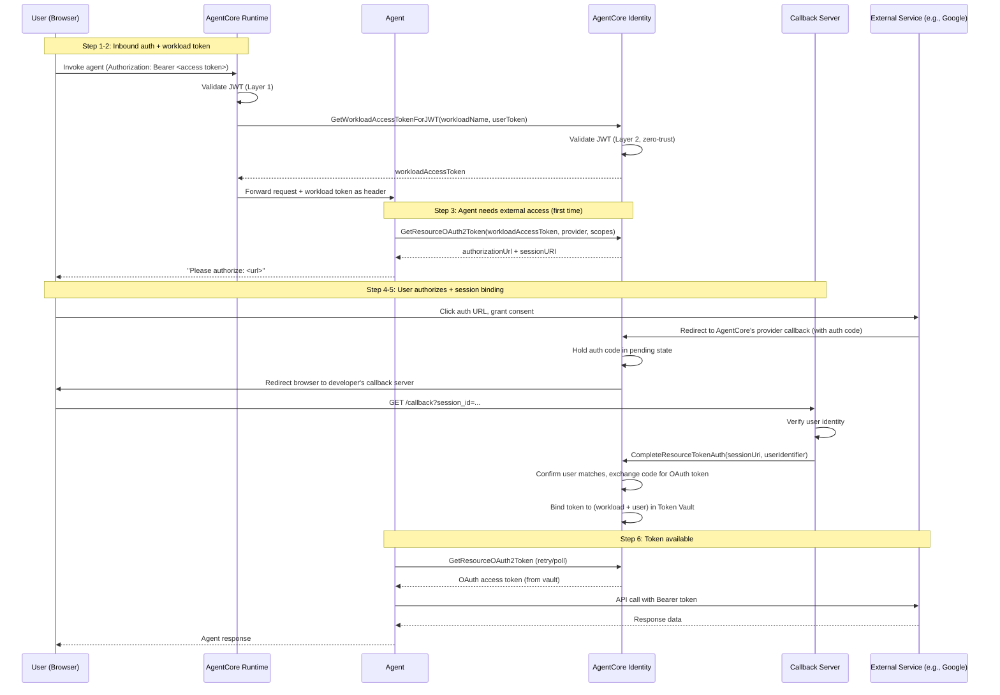

# Overview

This document analyzes the **Three-Legged OAuth (3LO)** flow in Amazon Bedrock AgentCore Identity — how agents securely access external services (GitHub, Google Calendar, etc.) **on behalf of authenticated users**. It covers both the platform-integrated (AgentCore Runtime) and self-hosted deployment models, and examines how JWT validation, workload identity, and session binding work together to form a trust chain.

Sources:

- [AgentCore Identity developer guide](https://docs.aws.amazon.com/bedrock-agentcore/latest/devguide/identity-overview.html)
- [Example 05: Runtime + Google Calendar 3LO](https://github.com/awslabs/amazon-bedrock-agentcore-samples/tree/main/01-tutorials/03-AgentCore-identity/05-Outbound_Auth_3lo)
- [Example 07: Self-hosted ECS + GitHub 3LO](https://github.com/awslabs/amazon-bedrock-agentcore-samples/tree/main/01-tutorials/03-AgentCore-identity/07-Outbound_Auth_3LO_ECS_Fargate)
- [AgentCore Python SDK](https://github.com/aws/bedrock-agentcore-sdk-python)

---

# Key Concepts

## What is 3LO?

Three-Legged OAuth (Authorization Code Grant) enables an **agent** to access **external services** on behalf of an authenticated user. The three legs are:

1. **User** authenticates and authorizes access
2. **Agent** requests and uses the OAuth token
3. **External service** (GitHub, Google, etc.) grants scoped access

## Core AgentCore Identity APIs

### [Control Plane](https://docs.aws.amazon.com/bedrock-agentcore-control/latest/APIReference/Welcome.html) (setup-time)

| API | Purpose |
| --- | --- |
| [`CreateWorkloadIdentity`](https://docs.aws.amazon.com/bedrock-agentcore-control/latest/APIReference/API_CreateWorkloadIdentity.html) | Register an agent workload. Sets `allowedResourceOauth2ReturnUrls` — an allow-list of callback URLs that AgentCore will accept for OAuth redirects. |
| [`CreateOauth2CredentialProvider`](https://docs.aws.amazon.com/bedrock-agentcore-control/latest/APIReference/API_CreateOauth2CredentialProvider.html) | Register an external OAuth provider (e.g., GitHub or Google OAuth app — client ID, secret, and vendor-specific config). Returns a provider-facing `callbackUrl` that must be registered as the redirect URI in the external provider's settings. |

### [Data Plane](https://docs.aws.amazon.com/bedrock-agentcore/latest/APIReference/Welcome.html) (runtime)

| API | Purpose |
| --- | --- |
| [`GetWorkloadAccessTokenForJWT`](https://docs.aws.amazon.com/bedrock-agentcore/latest/APIReference/API_GetWorkloadAccessTokenForJWT.html) | Get a workload access token for a (workload + user) pair by providing the user's access token (in JWT format) from the IdP (e.g., Cognito, Entra ID, Okta). AgentCore [cryptographically validates](https://docs.aws.amazon.com/bedrock-agentcore/latest/devguide/get-workload-access-token.html) the JWT via OIDC discovery. Used by AgentCore Runtime. |
| [`GetWorkloadAccessTokenForUserId`](https://docs.aws.amazon.com/bedrock-agentcore/latest/APIReference/API_GetWorkloadAccessTokenForUserId.html) | Same as above, but accepts a plain `userId` string instead of a JWT. AgentCore trusts the caller (via IAM) to have verified the user. Used by self-hosted agents. |
| [`GetResourceOAuth2Token`](https://docs.aws.amazon.com/bedrock-agentcore/latest/APIReference/API_GetResourceOauth2Token.html) | Request an external service token (e.g., GitHub). If a token exists in the vault, returns it. If not, returns an `authorizationUrl`  • `sessionURI` to initiate the OAuth consent flow. |
| [`CompleteResourceTokenAuth`](https://docs.aws.amazon.com/bedrock-agentcore/latest/APIReference/API_CompleteResourceTokenAuth.html) | Bind a completed OAuth session to a verified user. Called by the callback server after the user authorizes. Accepts either a `userId` string or a `userToken` JWT. |

---

# How Applications Authenticate to AgentCore

Before diving into the 3LO flow, it's worth understanding how the **calling application** (the thing that invokes the agent on behalf of a user) authenticates to AgentCore. AgentCore Runtime supports two [inbound authentication modes](https://docs.aws.amazon.com/bedrock-agentcore/latest/devguide/runtime-oauth.html) (mutually exclusive per Runtime):

**1. IAM SigV4 Authentication** — the default. The calling application authenticates via AWS IAM (SigV4-signed requests). User identity is passed explicitly via the `X-Amzn-Bedrock-AgentCore-Runtime-User-Id` header — AgentCore treats this as an opaque identifier and trusts the caller (via IAM) to provide the correct value. Internally, the Runtime uses `GetWorkloadAccessTokenForUserId` to obtain the workload access token. This path requires no separate application registration — IAM is the application identity layer. Each Runtime endpoint has an ARN, so standard IAM policies control which roles can invoke which agents.

**2. JWT Bearer Token Authentication** — the caller passes the user's access token (from an external IdP like Cognito, Entra ID, or Okta) as `Authorization: Bearer <access_token>`. The Runtime validates the JWT against the [`CustomJWTAuthorizerConfiguration`](https://docs.aws.amazon.com/bedrock-agentcore-control/latest/APIReference/API_CustomJWTAuthorizerConfiguration.html) — checking the signature (via OIDC discovery), expiration, audience, clients, and scopes. User identity is extracted from the token's `iss` + `sub` claims. Internally, the Runtime uses `GetWorkloadAccessTokenForJWT` to obtain the workload access token. No IAM credentials are needed on the caller side — the access token is the sole credential.

In both cases:

- **No token exchange** — the application doesn't swap the user's token for a platform-scoped one. The user's credential (access token or userId) flows through to AgentCore Identity directly.
- **No application registration** — there's no separate "register this application" step. In the IAM path, IAM policies handle application-level authorization. In the JWT path, the `CustomJWTAuthorizerConfiguration` (allowed audiences, clients, scopes) controls which tokens are accepted.
- **Direct API calls to AgentCore Identity** (e.g., `GetResourceOAuth2Token`, `CompleteResourceTokenAuth`) always require IAM credentials (SigV4), regardless of which inbound auth mode the Runtime uses. The Runtime handles this internally when hosted; self-hosted agents must provide their own IAM credentials.

---

# Prerequisites: Control Plane Setup

Before any runtime flow works, several one-time setup operations are needed.

## 1. Register a user-facing Identity Provider

An OAuth/OIDC application must be created in the user-facing IdP (e.g., Cognito, Entra ID, Okta). This produces a **client ID**, **client secret**, and the standard OIDC endpoints (issuer, authorization, token, userinfo).

**When using AgentCore Runtime**: These are configured as a [`CustomJWTAuthorizerConfiguration`](https://docs.aws.amazon.com/bedrock-agentcore-control/latest/APIReference/API_CustomJWTAuthorizerConfiguration.html) on [`CreateAgentRuntime`](https://docs.aws.amazon.com/bedrock-agentcore-control/latest/APIReference/API_CreateAgentRuntime.html) or [`CreateGateway`](https://docs.aws.amazon.com/bedrock-agentcore-control/latest/APIReference/API_CreateGateway.html). The Runtime validates incoming user access tokens against this configuration.

**When self-hosting**: You configure your own inbound authentication (e.g., ALB OIDC, or application-level JWT verification). The OIDC client ID/secret go into your infrastructure config (e.g., [AWS Secrets Manager + CDK](https://github.com/awslabs/amazon-bedrock-agentcore-samples/blob/main/01-tutorials/03-AgentCore-identity/07-Outbound_Auth_3LO_ECS_Fargate/cdk/constructs/compute/ecs_service.py)).

## 2. Register a Workload Identity

Call [`CreateWorkloadIdentity`](https://docs.aws.amazon.com/bedrock-agentcore-control/latest/APIReference/API_CreateWorkloadIdentity.html) to register the agent workload with AgentCore Identity. This tells the platform "this agent exists and is allowed to act on behalf of users."

The key field is `allowedResourceOauth2ReturnUrls` — an allow-list of callback URLs where AgentCore may redirect the user's browser after they complete an external OAuth consent flow. If someone tries to start an OAuth flow with a callback URL not in this list, AgentCore rejects it.

```json
{
  "name": "my-agent-workload",
  "allowedResourceOauth2ReturnUrls": [
    "https://myapp.example.com/oauth2/callback"
  ]
}
```

## 3. Register an External OAuth Provider

For each external service the agent needs to access (GitHub, Google Calendar, etc.):

1. **Create an OAuth app** on the external service (e.g., GitHub Developer Settings), producing a client ID and secret.
2. **Register it with AgentCore** via [`CreateOauth2CredentialProvider`](https://docs.aws.amazon.com/bedrock-agentcore-control/latest/APIReference/API_CreateOauth2CredentialProvider.html). AgentCore returns a provider-facing `callbackUrl` (an AgentCore Identity endpoint like `https://bedrock-agentcore.<region>.amazonaws.com/identities/oauth2/callback`).
3. **Register that `callbackUrl`** as the redirect URI in the external OAuth app's settings.

This means the external provider (GitHub, Google) redirects to **AgentCore Identity** after the user authorizes — AgentCore receives the authorization code and exchanges it for a token. This is distinct from the developer's callback URL (in `allowedResourceOauth2ReturnUrls`), which is where the *user's browser* ends up for session binding (see Step 4 in the runtime flow below).

## 4. Deploy a Callback Server for Session Binding

The developer must deploy a callback endpoint that handles the [OAuth session binding](https://docs.aws.amazon.com/bedrock-agentcore/latest/devguide/oauth2-authorization-url-session-binding.html) step. This is required in **both** the Runtime and self-hosted models — AgentCore Identity does not provide a managed callback endpoint in production.

The callback server's job is simple:

1. Receive the redirect (with a `session_id` query parameter)
2. Verify the identity of the user who completed the OAuth flow (e.g., from browser cookies, session state, or an authenticated header)
3. Call [`CompleteResourceTokenAuth`](https://docs.aws.amazon.com/bedrock-agentcore/latest/APIReference/API_CompleteResourceTokenAuth.html) with the `sessionUri` and the verified `userIdentifier`

The callback URL must be registered in the workload identity's `allowedResourceOauth2ReturnUrls`.

**Exception**: When developing locally with `agentcore dev`, the AgentCore CLI hosts the callback automatically.

## 5. Configure Permissions

The agent's runtime identity (IAM role for ECS, or the Runtime's built-in identity) needs permissions to call the AgentCore data plane APIs: `GetWorkloadAccessTokenForUserId`/`ForJWT`, `GetResourceOAuth2Token`, and `CompleteResourceTokenAuth`.

## Setup Summary

| What | Where | Who |
| --- | --- | --- |
| User-facing IdP (Cognito, Entra ID, Okta) | IdP portal | Admin |
| Inbound JWT validation config | [`CustomJWTAuthorizerConfiguration`](https://docs.aws.amazon.com/bedrock-agentcore-control/latest/APIReference/API_CustomJWTAuthorizerConfiguration.html) on Runtime/Gateway (or ALB OIDC for self-hosted) | Developer |
| Workload identity + allowed callback URLs | AgentCore Identity ([`CreateWorkloadIdentity`](https://docs.aws.amazon.com/bedrock-agentcore-control/latest/APIReference/API_CreateWorkloadIdentity.html)) | Developer |
| External OAuth app (GitHub, Google, etc.) | External provider's developer settings | Admin |
| OAuth credential provider | AgentCore Identity ([`CreateOauth2CredentialProvider`](https://docs.aws.amazon.com/bedrock-agentcore-control/latest/APIReference/API_CreateOauth2CredentialProvider.html)) | Developer |
| Provider redirect URI | External provider settings (set to AgentCore's returned `callbackUrl`) | Admin |
| Callback server for session binding | Developer-managed endpoint | Developer |
| IAM / runtime permissions | IAM policy or Runtime config | Developer |

---

# The 3LO Runtime Flow

This section describes the end-to-end 3LO flow for an agent deployed on AgentCore Runtime. It focuses on **what happens conceptually at each step**, independent of any particular SDK or framework.

## Step 1: Inbound authentication

A user (or an application acting on behalf of a user) sends a request to the agent's Runtime endpoint, including the user's **access token** (in JWT format, from the IdP) in the `Authorization` header. The Runtime validates this JWT against the [`CustomJWTAuthorizerConfiguration`](https://docs.aws.amazon.com/bedrock-agentcore-control/latest/APIReference/API_CustomJWTAuthorizerConfiguration.html) — checking the signature (via JWKS from the OIDC discovery URL), expiration, audience, client, and scopes. This is the **trust boundary** that determines which IdPs are accepted.

## Step 2: Workload token issuance

The Runtime calls [`GetWorkloadAccessTokenForJWT`](https://docs.aws.amazon.com/bedrock-agentcore/latest/APIReference/API_GetWorkloadAccessTokenForJWT.html), passing the agent's workload name and the user's access token. AgentCore Identity [cryptographically validates](https://docs.aws.amazon.com/bedrock-agentcore/latest/devguide/get-workload-access-token.html) the JWT independently (defense-in-depth — see [Appendix: JWT Validation Architecture](#appendix-jwt-validation-architecture)) and returns a **workload access token** representing the (agent + user) pair.

The Runtime delivers this token — and optionally a callback URL — to the agent as payload headers on the invocation request. The agent never needs to call `GetWorkloadAccessToken` itself.

## Step 3: Requesting an external OAuth token

When the agent needs to access an external service (e.g., GitHub, Google Calendar), it calls [`GetResourceOAuth2Token`](https://docs.aws.amazon.com/bedrock-agentcore/latest/APIReference/API_GetResourceOauth2Token.html) with the workload access token, the provider name, and the requested scopes. Two outcomes:

- **Token exists in the vault**: AgentCore returns the cached OAuth access token. The agent proceeds to call the external service.
- **No token yet**: AgentCore returns an `authorizationUrl` and a `sessionURI`. The agent surfaces the authorization URL to the user and waits (typically by polling `GetResourceOAuth2Token` with the `sessionURI` until the token appears, or by ending the invocation and retrying on the next user message).

## Step 4: User authorizes on the external service

The user clicks the authorization URL and grants consent on the external service (e.g., Google’s consent screen). The external provider redirects the user’s browser back to **AgentCore Identity’s provider-facing callback endpoint** (the URL returned by [`CreateOauth2CredentialProvider`](https://docs.aws.amazon.com/bedrock-agentcore-control/latest/APIReference/API_CreateOauth2CredentialProvider.html) during setup). AgentCore receives the authorization code but **does not exchange it yet** — it holds the code in a pending state until session binding confirms the user’s identity.

## Step 5: Session binding

After receiving the authorization code, AgentCore Identity redirects the user's browser to the **developer's callback server** (the URL provided as `resourceOauth2ReturnUrl` to `GetResourceOAuth2Token`, which must be in the workload identity's `allowedResourceOauth2ReturnUrls`).

The callback server's job is to **independently verify the user's identity** — the OAuth callback itself carries no information about who the person in the browser is, only the session URI. The callback server checks the user's identity (via browser cookies, an authenticated session, or a pre-stored token) and calls [`CompleteResourceTokenAuth`](https://docs.aws.amazon.com/bedrock-agentcore/latest/APIReference/API_CompleteResourceTokenAuth.html) with the `sessionUri` and the verified `userIdentifier`. Only after this confirmation does AgentCore exchange the authorization code for an OAuth token and store it in the Token Vault.

This step exists to prevent **authorization URL hijacking** — where User B completes User A's OAuth flow, and User A's agent ends up with access to User B's data.

## Step 6: Token is available

Once `CompleteResourceTokenAuth` succeeds, the token is bound to the (workload + user + provider) tuple in the Token Vault. The next call to `GetResourceOAuth2Token` returns the cached token. On all subsequent requests, the token is available immediately — no authorization flow needed (until the token expires or is revoked).

## End-to-End Flow



## Variations

The two sample implementations differ in some details, but the overall flow is the same:

| Aspect | [Example 05](https://github.com/awslabs/amazon-bedrock-agentcore-samples/tree/main/01-tutorials/03-AgentCore-identity/05-Outbound_Auth_3lo) (Runtime + Google Calendar) | [Example 07](https://github.com/awslabs/amazon-bedrock-agentcore-samples/tree/main/01-tutorials/03-AgentCore-identity/07-Outbound_Auth_3LO_ECS_Fargate) (Self-hosted + GitHub) |
| --- | --- | --- |
| Agent hosting | AgentCore Runtime | Self-hosted on ECS Fargate |
| Inbound auth | Runtime validates JWT via [`CustomJWTAuthorizerConfiguration`](https://docs.aws.amazon.com/bedrock-agentcore-control/latest/APIReference/API_CustomJWTAuthorizerConfiguration.html) | ALB OIDC validates JWT at the infrastructure layer |
| Workload token | Runtime calls [`GetWorkloadAccessTokenForJWT`](https://docs.aws.amazon.com/bedrock-agentcore/latest/APIReference/API_GetWorkloadAccessTokenForJWT.html) automatically, delivers as header | Agent code calls [`GetWorkloadAccessTokenForUserId`](https://docs.aws.amazon.com/bedrock-agentcore/latest/APIReference/API_GetWorkloadAccessTokenForUserId.html) explicitly via boto3 |
| Token decorator | Official SDK decorator (reads workload token from context) | [Custom decorator](https://github.com/awslabs/amazon-bedrock-agentcore-samples/blob/main/01-tutorials/03-AgentCore-identity/07-Outbound_Auth_3LO_ECS_Fargate/backend/runtime/agent/tools/auth.py) (accepts workload token as explicit parameter) |
| Callback server | [Local FastAPI server](https://github.com/awslabs/amazon-bedrock-agentcore-samples/blob/main/01-tutorials/03-AgentCore-identity/05-Outbound_Auth_3lo/oauth2_callback_server.py) on [localhost:9090](http://localhost:9090) | [Separate ECS Fargate task](https://github.com/awslabs/amazon-bedrock-agentcore-samples/blob/main/01-tutorials/03-AgentCore-identity/07-Outbound_Auth_3LO_ECS_Fargate/backend/session_binding/app/routers/session_binding.py) behind the same ALB |
| User identity at callback | Pre-stored Cognito access token, passed as `UserTokenIdentifier` to `CompleteResourceTokenAuth` | Extracted from ALB OIDC header, passed as plain `userId` string |
| "No token" behavior | SDK decorator polls (blocks the tool call) | Custom decorator raises an exception (invocation ends; token is available on next invocation) |

---

# Trust Chain

The 3LO flow relies on a chain of trust where each layer verifies a specific claim and prevents a specific class of attack. Understanding what each layer proves — and what goes wrong if it's bypassed — is important for evaluating the security posture.

## Runtime model

### 1. IdP verifies the human

The user authenticates against their organization's IdP (Cognito, Entra ID, Okta) and receives an access token (in JWT format).

- **What it proves**: The person at the keyboard is who they claim to be (verified by the IdP via password, MFA, etc.).
- **What it prevents**: Unauthenticated access. Without this, anyone could claim to be any user.

### 2. Runtime validates the JWT (Layer 1)

The Runtime checks the user's access token against the [`CustomJWTAuthorizerConfiguration`](https://docs.aws.amazon.com/bedrock-agentcore/latest/devguide/inbound-jwt-authorizer.html) — verifying the signature (via JWKS), expiration, issuer, audience, client, scopes, and custom claims.

- **What it proves**: The token was issued by a trusted IdP, is intended for this specific agent/runtime (audience), hasn't expired, and carries the required scopes.
- **What it prevents**: Tokens from untrusted IdPs, tokens intended for other services (wrong audience), expired tokens, and tokens lacking required permissions. This is the **trust boundary** — the point where the platform decides which IdPs it accepts.

### 3. AgentCore Identity re-validates the JWT (Layer 2)

When [`GetWorkloadAccessTokenForJWT`](https://docs.aws.amazon.com/bedrock-agentcore/latest/APIReference/API_GetWorkloadAccessTokenForJWT.html) is called, AgentCore Identity independently validates the JWT signature and expiration via dynamic OIDC discovery from the `iss` claim (see [Appendix: JWT Validation Architecture](#appendix-jwt-validation-architecture)).

- **What it proves**: The JWT is cryptographically valid, regardless of whether Layer 1 checked it. This is defense-in-depth — if Layer 1 is misconfigured or bypassed (e.g., in self-hosted mode), Layer 2 still catches invalid tokens.
- **What it prevents**: A compromised or misconfigured Runtime passing a forged or invalid JWT to the Identity service. Also prevents self-hosted backends from passing arbitrary tokens without at least signature validation.
- **What it does NOT check**: Layer 2 has no issuer allow-list (unlike Layer 1). It accepts any JWT validly signed by its declared OIDC issuer. See [implications for self-hosted agents](#implications-for-self-hosted-agents).

### 4. Workload access token issuance

AgentCore issues a workload access token representing the specific (agent + user) pair. This token is delivered to the agent as a payload header and must be presented on all subsequent calls to `GetResourceOAuth2Token`.

- **What it proves**: The infrastructure (Runtime) has authorized this specific agent to act on behalf of this specific user. The token is a **capability token** — it carries proof that the infrastructure vetted and approved this pairing.
- **What it prevents**: **Agent privilege escalation.** Without this, agent code could claim to be any agent or act for any user when requesting external tokens. The workload access token ensures that only the (agent + user) pair that the Runtime authorized can access the Token Vault. A compromised agent can only access tokens for the user whose request it's currently handling — it cannot forge a token for a different user or a different agent.
- **Why it's needed**: The agent code itself is not trusted. It runs user-provided or third-party code. The workload access token is the boundary between trusted infrastructure (Runtime) and untrusted code (agent).

### 5. Token Vault scoping

The Token Vault stores external OAuth tokens keyed by `(workload + user + provider)`. When `GetResourceOAuth2Token` is called, the workload access token determines which vault entries the caller can access.

- **What it proves**: Token isolation. Agent A cannot access Agent B's tokens. User X's tokens are not accessible to User Y's agent.
- **What it prevents**: Cross-agent and cross-user token leakage. Even if two agents share the same runtime infrastructure, their tokens are isolated.

### 6. Session binding

The developer's callback server verifies the user's identity at the OAuth callback and calls `CompleteResourceTokenAuth` with the verified `userIdentifier`.

- **What it proves**: The person who completed the OAuth consent flow (in the browser) is the same person who initiated it (via the agent invocation).
- **What it prevents**: **Authorization URL hijacking.** Without session binding, User B could complete User A's OAuth flow, causing User A's agent to receive User B's external service token. Session binding ensures the token is bound to the correct user.
- **How it works**: The user's identity at the callback **never comes from URL parameters or the OAuth redirect** — the OAuth callback only carries an authorization code and a session URI. The user identity comes from a separately verified source: ALB OIDC session, pre-stored access token, browser cookies, etc. This is what makes session binding non-spoofable.

## Self-hosted model

In the self-hosted model, layers 1-3 are replaced by the developer's own authentication:

| Runtime model | Self-hosted equivalent | What changes |
| --- | --- | --- |
| Layer 1: Runtime validates JWT | Developer's own inbound auth (e.g., ALB OIDC) | The developer is responsible for configuring which IdPs are trusted. No `CustomJWTAuthorizerConfiguration`. |
| Layer 2: AgentCore re-validates JWT | Skipped (if using `ForUserId`) or partially applied (if using `ForJWT`) | With `ForUserId`, AgentCore never sees a JWT — it trusts the caller via IAM to provide the correct `userId`. With `ForJWT`, Layer 2 applies but has no issuer allow-list. |
| Layer 3: IAM authorizes the call | Same — IAM role must have permission to call `GetWorkloadAccessToken` | This is the only thing preventing an unauthorized service from requesting workload tokens for arbitrary (agent + user) pairs. |
| Layer 4-6 | Same | Workload access token, Token Vault scoping, and session binding work identically. |

The critical difference is **who the platform trusts**:
- **Runtime model**: The platform trusts the Runtime (Layer 1) to validate the JWT and the Identity Service (Layer 2) to re-validate it. The agent code is untrusted.
- **Self-hosted model**: The platform trusts the developer's backend (via IAM) to have correctly verified the user. If the backend is compromised, an attacker can request workload tokens for any user.

> **Key takeaway**: The workload access token is the critical boundary between trusted infrastructure and untrusted agent code. It exists because the agent cannot be trusted to self-assert its identity or the user it's acting for. Every layer above it (JWT validation, IAM auth) exists to ensure that only properly authenticated requests can produce a workload access token. Every layer below it (Token Vault scoping, session binding) uses it to enforce isolation.
> 

---

# Appendix: JWT Validation Architecture

AgentCore Identity implements a **zero-trust, two-layer JWT validation model**.

## Layer 1: Runtime/Gateway (Trust Boundary)

Configured explicitly via [`CustomJWTAuthorizerConfiguration`](https://docs.aws.amazon.com/bedrock-agentcore-control/latest/APIReference/API_CustomJWTAuthorizerConfiguration.html) on [`CreateAgentRuntime`](https://docs.aws.amazon.com/bedrock-agentcore-control/latest/APIReference/API_CreateAgentRuntime.html) or [`CreateGateway`](https://docs.aws.amazon.com/bedrock-agentcore-control/latest/APIReference/API_CreateGateway.html). This is where you specify the OIDC discovery URL, allowed audiences, clients, scopes, and custom claims. It defines **which IdPs are trusted**.

## Layer 2: Identity Service (Defense-in-Depth)

When [`GetWorkloadAccessTokenForJWT`](https://docs.aws.amazon.com/bedrock-agentcore/latest/APIReference/API_GetWorkloadAccessTokenForJWT.html) is called, AgentCore Identity **independently validates the JWT signature and expiration**, regardless of whether Layer 1 already validated it. From the [official docs](https://docs.aws.amazon.com/bedrock-agentcore/latest/devguide/get-workload-access-token.html):

> *"When you provide a JWT, AgentCore Identity will validate the JWT to ensure it is correctly signed and unexpired, and use its 'iss' and 'sub' claims to uniquely identify the user."*
> 

From the [how-it-works guide](https://github.com/awslabs/amazon-bedrock-agentcore-samples/blob/main/01-tutorials/03-AgentCore-identity/02-how_it_works.md):

> *"The AgentCore Identity performs comprehensive zero trust validation of the request, including verifying the agent's identity, validating the user's original OAuth/OIDC token signature and claims... This validation occurs regardless of the source or previous trust relationships."*
> 

## How AgentCore discovers the JWKS

[`CreateWorkloadIdentity`](https://docs.aws.amazon.com/bedrock-agentcore-control/latest/APIReference/API_CreateWorkloadIdentity.html) has no IdP or JWKS fields. Instead, AgentCore uses **dynamic OIDC discovery from the JWT's `iss` claim**. From the [inbound JWT authorizer docs](https://docs.aws.amazon.com/bedrock-agentcore/latest/devguide/inbound-jwt-authorizer.html):

> *"It allows AgentCore Identity to dynamically accept tokens issued by your OIDC identity provider without explicit onboarding."*
> 

When `GetWorkloadAccessTokenForJWT` receives a JWT, it extracts the `iss` claim, fetches `{iss}/.well-known/openid-configuration`, retrieves the JWKS URI, and validates the signature against the public keys.

## Summary

| Layer | Where | What it validates | How the IdP is configured |
| --- | --- | --- | --- |
| **Layer 1: Runtime/Gateway** | Inbound request gate | Signature, expiration, issuer, audience, clients, scopes, custom claims | Explicitly via [`CustomJWTAuthorizerConfiguration`](https://docs.aws.amazon.com/bedrock-agentcore-control/latest/APIReference/API_CustomJWTAuthorizerConfiguration.html) |
| **Layer 2: Identity Service** | [`GetWorkloadAccessTokenForJWT`](https://docs.aws.amazon.com/bedrock-agentcore/latest/APIReference/API_GetWorkloadAccessTokenForJWT.html) | Signature, expiration | Dynamically via OIDC discovery from the JWT's `iss` claim — no explicit issuer allow-list |

## Implications for self-hosted agents

Self-hosted agents bypass Layer 1. If they use `GetWorkloadAccessTokenForJWT`, only Layer 2 applies — AgentCore validates the JWT signature but has no documented issuer allow-list. It will accept any JWT validly signed by its declared OIDC issuer. The security model relies on the self-hosted backend having already validated the JWT, and IAM permissions gating who can call the API.

If self-hosted agents use `GetWorkloadAccessTokenForUserId` instead (as example 07 does), AgentCore never sees a JWT at all — it trusts the caller to provide the correct `userId`.

## `ForUserId` vs `ForJWT`

| Aspect | [`ForUserId`](https://docs.aws.amazon.com/bedrock-agentcore/latest/APIReference/API_GetWorkloadAccessTokenForUserId.html) | [`ForJWT`](https://docs.aws.amazon.com/bedrock-agentcore/latest/APIReference/API_GetWorkloadAccessTokenForJWT.html) |
| --- | --- | --- |
| Input | `workloadName`  • `userId` (plain string) | `workloadName`  • `userToken` (access token in JWT format from the IdP) |
| Who verifies the user? | Your backend — you verify the JWT and extract userId | AgentCore Identity — cryptographically validates the JWT, extracts identity from `iss`  • `sub` |
| JWKS discovery | N/A | Dynamic OIDC discovery from the `iss` claim |
| Typical usage | Self-hosted agents | AgentCore Runtime (automatic) |