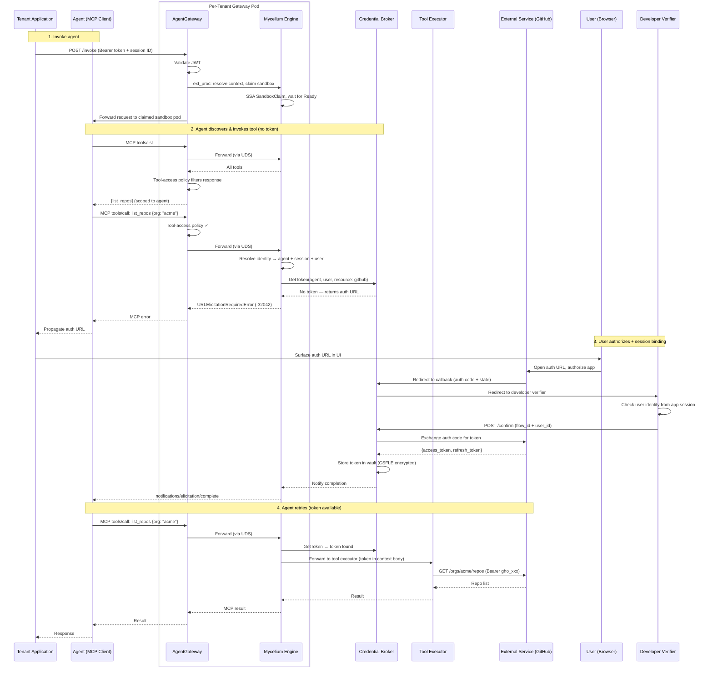

# Mycelium: Agent Identity, Delegated Access & Tool Orchestration

**Date:** 2026-04-11
**Status:** Draft
**Authors:** Simon Zhu

---

## Overview

Mycelium is the identity, credential brokering, and tool orchestration layer for the agentic platform. It enables AI agents to act on behalf of authenticated users to access external services (GitHub, Jira, Google Calendar, etc.) via Three-Legged OAuth (3LO), without the agent ever seeing tokens or managing OAuth flows.

The system consists of three components:

- **Mycelium Engine** — a sidecar deployed alongside each per-tenant AgentGateway pod, communicating over a [Unix domain socket](https://github.com/agentgateway/agentgateway/pull/1533). Serves as an MCP server (behind AgentGateway's [native MCP support](https://agentgateway.dev/docs/kubernetes/latest/mcp/static-mcp/)) for tool invocation and session resolution, and as an Envoy ext_proc for inbound session establishment and agent-to-agent routing. Calls the credential broker over internal RPC for token management. Uses MCP [URL mode elicitation](https://modelcontextprotocol.io/specification/draft/client/elicitation#url-mode-elicitation-for-oauth-flows) to trigger OAuth flows when tokens are unavailable.
- **Mycelium Credential Broker** — a shared service that owns the full OAuth lifecycle: provider registrations, OAuth callbacks, authorization code exchange, session binding, token storage/refresh, and per-tenant encryption. Backed by MongoDB with CSFLE.
- **Mycelium Controller** — a Kubernetes controller that watches Mycelium CRDs and generates AgentGateway resources, Knative Services for Tool Executors, MCP tool-access policies, and credential broker configuration.

---

## Goals

1. **Agents never see user tokens or OAuth credentials.** The engine resolves context (which agent, which session, which user) and injects credentials transparently.
2. **Agents discover and invoke tools through MCP.** Agents talk to AgentGateway via MCP. AGW routes to the engine, which handles credential injection and forwards to Tool Executors. AGW's [tool-access policies](https://agentgateway.dev/docs/kubernetes/latest/mcp/tool-access/) gate which agents can see and invoke which tools — the engine serves all tools and AGW filters the response.
3. **Delegated access via MCP [URL mode elicitation](https://modelcontextprotocol.io/specification/draft/client/elicitation#url-mode-elicitation-for-oauth-flows)** — the standard MCP protocol for triggering third-party OAuth flows, with built-in [session binding](https://modelcontextprotocol.io/specification/draft/client/elicitation#phishing) to prevent confused-deputy attacks.
4. **Per-tenant encryption** of stored tokens via MongoDB Client-Side Field Level Encryption (CSFLE) with customer-managed KMS (AWS KMS, Azure Key Vault, GCP KMS).
5. **Declarative configuration** via Kubernetes CRDs — provider registration, tool definitions, and tenant configuration are all CRD-driven.
6. **Tool Executors are one-shot, stateless workers** powered by [Knative Serving](https://knative.dev/docs/serving/) with `containerConcurrency: 1`. The platform generates Knative Services from ToolConfig CRDs.

## Non-Goals (for MVP)

- Background token refresh (refresh is on-demand)
- API key management (AgentGateway already has good support; can be added later)
- Auto-extraction of tool parameter schemas from code (manually declared in CRDs for now)
- Multi-cluster federation of the identity layer
- Knative Eventing (async/event-driven tool patterns)

---

## Architecture

### Components

| Component | What it is | Language | Deployed where |
| --- | --- | --- | --- |
| **Mycelium Engine** | AGW sidecar. MCP server (behind AGW, via UDS) + ext_proc (inbound sessions) + pod claimer. Calls credential broker for tokens. | Go | Per-tenant, sidecar to each AGW pod |
| **Mycelium Credential Broker** | Shared service. OAuth callbacks, code exchange, session binding, token vault (MongoDB + CSFLE), on-demand refresh. | Go | `mycelium-system` namespace (per cell) |
| **Mycelium Controller** | K8s controller. Watches CRDs, generates AGW resources + Knative Services + credential broker config. | Go | `mycelium-system` namespace (per cell) |

### Deployment Topology

```
Cell Cluster
┌───────────────────────────────────────────────┐
│  tenant-a namespace                           │
│                                               │
│  ┌──────────────────────────────┐             │
│  │ AGW Pod                      │             │
│  │  ├─ AgentGateway             │             │
│  │  │   (MCP routing,           │             │
│  │  │    tool-access policies,  │             │
│  │  │    JWT validation)        │             │
│  │  └─ Mycelium Engine (sidecar)│──── RPC ────┐
│  │     (MCP server, ext_proc,   │             │
│  │      pod claimer)      [UDS] │             │
│  └──────────────────────────────┘             │
│                                               │
│  Agent Sandboxes (agent-sandbox)              │
│                                               │
│  Tool Executors (Knative Services)            │
│  ┌────────────┐ ┌────────────┐                │
│  │ list-repos │ │create-issue│  ...           │
│  │ (Knative)  │ │ (Knative)  │                │
│  │ concurr: 1 │ │ concurr: 1 │                │
│  │ scale: 0→N │ │ scale: 0→N │                │
│  └────────────┘ └────────────┘                │
└───────────────────────────────────────────────┘

┌────────────────────────────────────────────────┐
│  mycelium-system namespace                     │
│                                                │
│  Mycelium Controller                           │
│  (watches CRDs, generates AGW config           │
│   + Knative Services + credential broker cfg)  │
│                                                │
│  Mycelium Credential Broker ──── MongoDB       │
│  (OAuth callbacks, token vault,   (CSFLE,      │
│   session binding, refresh)    per-tenant KMS) │
└────────────────────────────────────────────────┘
```

Each tenant's AGW pod(s) run the engine as a sidecar, communicating over a Unix domain socket. The engine calls the credential broker over internal RPC for token management — it never connects to MongoDB directly.

Tool Executors run as Knative Services with `containerConcurrency: 1` — Knative handles scaling (including scale-to-zero), concurrency enforcement, and routing to free pods. The engine calls each tool's Knative Service URL; no warm pools or claims are needed for tool pods.

### Dependencies

| Dependency | Version | Purpose |
| --- | --- | --- |
| [agent-sandbox](https://github.com/kubernetes-sigs/agent-sandbox) | v0.1.1+ | Sandbox, SandboxClaim, SandboxWarmPool, SandboxTemplate CRDs and controllers for Agent Sandbox pod lifecycle |
| [AgentGateway](https://agentgateway.dev) | 0.12.0+ | Per-tenant gateway with JWT validation, CEL policy engine, ext_proc, WDS, native MCP support (routing, tool-access, rate limiting) |
| [Knative Serving](https://knative.dev/docs/serving/) | 1.x | Tool Executor runtime: `containerConcurrency: 1`, auto-scaling, scale-to-zero |
| MongoDB | 7.0+ | Token vault with CSFLE support |
| Go MCP SDK | TBD | MCP server implementation in the engine |

---

## CRDs

API group: `mycelium.io/v1alpha1`

### TenantConfig

Per-tenant settings including identity provider configuration and verifier URL.

```yaml
apiVersion: mycelium.io/v1alpha1
kind: TenantConfig
metadata:
  name: config
  namespace: tenant-a
spec:
  userVerifierUrl: "https://app.acme.com/verify"
  identityProvider:
    issuer: "https://accounts.google.com"
    audiences: ["mycelium-tenant-a"]
    allowedClients: ["<client-id>"]
    allowedScopes: ["openid", "profile"]
```

The Mycelium Controller watches TenantConfig and generates:
- AgentGateway JWT validation policy (`jwtAuthentication`) targeting the tenant gateway's external listener
- Identity injection transformation policy on the internal listener
- `AgentgatewayBackend` for the engine as an MCP server
- `HTTPRoute` routing `/mcp` traffic to the engine backend

### OAuthResource

External OAuth provider registration per tenant. Client secrets are stored in a Kubernetes Secret and referenced by name.

```yaml
apiVersion: mycelium.io/v1alpha1
kind: OAuthResource
metadata:
  name: github
  namespace: tenant-a
spec:
  authorizationEndpoint: "https://github.com/login/oauth/authorize"
  tokenEndpoint: "https://github.com/login/oauth/access_token"
  clientId: "Iv1.abc123"
  clientSecretRef:
    name: github-oauth-secret
    key: client-secret
  # Optional: OIDC discovery (if set, endpoints are auto-discovered)
  # discoveryUrl: "https://accounts.google.com/.well-known/openid-configuration"
```

### ToolConfig

Tool declaration with resource reference, scopes, and MCP-compatible input schema. Each ToolConfig references an OAuthResource in the same namespace (if the tool requires delegated access) and defines the tool's input schema following the [MCP tool schema format](https://modelcontextprotocol.info/docs/concepts/tools/).

```yaml
apiVersion: mycelium.io/v1alpha1
kind: ToolConfig
metadata:
  name: list-repos
  namespace: tenant-a
spec:
  toolName: list_repos
  description: "List GitHub repos for an org."
  resource:
    ref:
      group: mycelium.io
      kind: OAuthResource
      name: github
    scopes: ["repo"]
  inputSchema:
    type: object
    properties:
      org:
        type: string
        description: "GitHub organization name"
    required: ["org"]
  # Tool executor container spec (used to generate Knative Service)
  container:
    image: tenant-a/tool-list-repos:latest
    # Optional scaling overrides
  scaling:
    minScale: 0           # scale to zero when idle (default)
    maxScale: 10
```

Agent definitions (e.g., kagent Agent CRD) reference ToolConfigs via a `tools:` field. The Mycelium Controller inverts this mapping to generate AGW MCP tool-access policies.

The Mycelium Controller watches ToolConfig and agent definitions and generates:
- A **Knative Service** per ToolConfig (with `containerConcurrency: 1`)
- An **AgentgatewayPolicy** with `backend.mcp.authorization` — CEL expressions gating which agents can see/invoke which tools

---

## Mycelium Engine

### Responsibilities

1. **MCP Server** — serves all ToolConfigs as MCP tools. AgentGateway's [tool-access policies](https://agentgateway.dev/docs/kubernetes/latest/mcp/tool-access/) filter `tools/list` responses per agent — the engine doesn't need to implement scoping logic. On `tools/call`, the engine calls the credential broker for tokens, injects them into the tool execution context, and forwards to the Tool Executor's Knative Service. When a token is unavailable, the engine returns a [`URLElicitationRequiredError`](https://modelcontextprotocol.io/specification/draft/client/elicitation#url-elicitation-required-error) (code `-32042`) to trigger the standard MCP OAuth flow.
2. **ext_proc (Envoy External Processor)** — handles non-MCP traffic: inbound session establishment (pod claiming for Agent Sandboxes) and agent-to-agent routing.
3. **Pod Claimer** — maintains an informer cache of Sandbox/SandboxClaim CRDs for Agent Sandboxes. The cache is used as an existence check; routing always uses the deterministic Service FQDN (`claim-{agent}-{hash(session)}.{namespace}.svc.cluster.local`), never pod IPs directly. On cache miss (new session), claims a pod via Server-Side Apply with a deterministic name for idempotency. (Not needed for Tool Executors — Knative handles that.)

### How MCP Traffic Flows Through AGW

Agents do not talk to the engine directly. All MCP traffic flows through AgentGateway, which provides authentication, tool-access gating, and rate limiting before reaching the engine:

```
Agent Sandbox
  → AGW internal listener (/mcp)
  → AGW: JWT validation (if configured)
  → AGW: tool-access policy filters tools/list response
         and gates tools/call by agent identity
  → AGW: forwards to Mycelium Engine (AgentgatewayBackend, MCP)
  → Engine: resolves agent identity (from AGW-injected headers)
  → Engine: on tools/call, looks up credentials, calls Tool Executor
```

The engine identifies the calling agent from identity headers injected by AGW's transformation policy (`X-Source-Pod-IP`, `X-Source-Service-Account`), then uses its informer cache to resolve the full context (agent, session, user).

### Informer Cache

The engine watches Sandbox and SandboxClaim resources in its tenant namespace via a Kubernetes informer. This provides a fast, in-memory map of:

```
pod IP → (agent name, session ID, user identity)
```

The cache is kept in sync via the watch stream. On a cache miss for an external invocation (new session), the engine creates a SandboxClaim via Server-Side Apply:

```
claim name: claim-{agent}-{hash(session-id)}
```

This is idempotent — concurrent requests for the same session both apply the same claim. The engine waits for the claim to become Ready (pod assigned), then updates the cache.

### Credential Broker

The credential broker is a shared service (deployed in `mycelium-system`) that owns all credential lifecycle operations. The engine communicates with it over internal RPC.

**Token Vault:** Tokens are stored in MongoDB with Client-Side Field Level Encryption (CSFLE). Sensitive fields (`access_token`, `refresh_token`) are encrypted client-side before they reach the database.

**Key structure:** `(tenant, agent, user, resource, scopes)`

**Per-tenant KMS:** Each tenant's tokens are encrypted with their own KMS master key. Tenants can bring their own KMS provider (AWS KMS, Azure Key Vault, GCP KMS), enabling them to revoke access to their tokens at any time. See [MongoDB CSFLE with AWS KMS](https://www.mongodb.com/docs/manual/core/csfle/tutorials/aws/aws-automatic/).

**On-demand refresh:** When a `GetToken` call finds an expired token, the credential broker refreshes it inline (using the stored refresh token), updates the vault, and returns the new token. If the refresh fails (e.g., refresh token revoked), the vault entry is deleted and the broker returns an auth-required response with the provider's authorization URL.

**OAuth callbacks and session binding:** The credential broker owns the provider-facing callback endpoint (e.g., `/oauth2/callback/{resource-id}`). After receiving the authorization code, it performs session binding via the developer-managed verifier (see [Magenta-auth: Session Binding Approaches](../Magenta-auth.md#session-binding-approaches)) before exchanging the code for tokens.

### Tool Invocation Flow

When an agent calls a tool via MCP (`tools/call`):

1. AGW validates the request ([tool-access policy](https://agentgateway.dev/docs/kubernetes/latest/mcp/tool-access/)) and forwards to the engine
2. Engine reads agent identity from AGW-injected headers (`X-Source-Pod-IP`, `X-Source-Service-Account`)
3. Engine resolves full context via informer cache: pod IP → (agent, session, user)
4. Engine looks up the ToolConfig to determine the required resource and scopes
5. Engine calls the credential broker: `GetToken(tenant, agent, user, resource, scopes)`
   - **Token valid** → broker returns the token
   - **Token expired** → broker refreshes inline, returns new token
   - **No token** → broker returns the provider's authorization URL + `elicitationId`
6. If token available: engine forwards to the tool's Knative Service with the token injected in the execution context body. Tool Executor calls the external API, returns the result.
7. If no token: engine returns a [`URLElicitationRequiredError`](https://modelcontextprotocol.io/specification/draft/client/elicitation#url-elicitation-required-error) (code `-32042`) to the agent, which propagates it to the user's application.
8. After the user completes the OAuth flow (via the credential broker's callback), the broker notifies the engine, which sends [`notifications/elicitation/complete`](https://modelcontextprotocol.io/specification/draft/client/elicitation#completion-notifications-for-url-mode-elicitation) to the agent. The agent retries the `tools/call`.
9. Engine returns the result to the agent via MCP

### OAuth Callback and Session Binding

When a user completes an OAuth authorization on an external provider (e.g., GitHub's consent screen), the provider redirects to the **credential broker's** callback endpoint:

```
GET /oauth2/callback/{resource-id}?code=...&state=...
```

The credential broker:

1. Receives the authorization code but **does not exchange it yet** — holds it in a pending state in MongoDB
2. Redirects the user's browser to the **developer's verifier endpoint** (from TenantConfig `userVerifierUrl`) with the `flow_id` as a query parameter
3. The verifier checks the user's identity from the application's own session and confirms by calling:
   ```
   POST /oauth2/confirm?flow_id=...&user_id=...
   ```
4. Only after confirmation does the credential broker exchange the authorization code for tokens and store them in the vault, keyed by `(tenant, agent, user, resource, scopes)`
5. The credential broker notifies the engine, which sends [`notifications/elicitation/complete`](https://modelcontextprotocol.io/specification/draft/client/elicitation#completion-notifications-for-url-mode-elicitation) to the agent

---

## Mycelium Controller

### Reconciliation Loops

**On TenantConfig create/update:**
1. Generate AgentGateway JWT validation policy targeting the tenant gateway's external listener
2. Generate identity injection transformation policy on the internal listener (inject `X-Source-Pod-IP`, `X-Source-Service-Account` via CEL)
3. Generate `AgentgatewayBackend` for the engine as an MCP server
4. Generate `HTTPRoute` routing `/mcp` to the engine backend
5. Update TenantConfig status with reconciliation state

**On ToolConfig create/update:**
1. Generate a **Knative Service** for the tool executor (from `spec.container` + `spec.scaling`, with `containerConcurrency: 1`)
2. Recompute the **tool-access AgentgatewayPolicy** by scanning which agents reference which ToolConfigs
3. Update ToolConfig status (Knative Service URL, ready state)

**On agent definition change (tool list updated):**
1. Recompute tool-access policy CEL expressions for all affected ToolConfigs
2. Update the `AgentgatewayPolicy` with `backend.mcp.authorization`

**On OAuthResource create/update:**
1. Validate provider endpoints are well-formed
2. Push provider registration to the credential broker (client ID, endpoints, secret ref)
3. Update OAuthResource status with the generated callback URL (credential broker's endpoint)

### Generated AgentGateway Resources

For a tenant with a GitHub `OAuthResource`, a `list-repos` ToolConfig, and agents `github-assistant` and `multi-tool-agent`:

```yaml
# Engine as an MCP backend via UDS (generated once per tenant from TenantConfig)
apiVersion: agentgateway.dev/v1alpha1
kind: AgentgatewayBackend
metadata:
  name: mycelium-engine
  namespace: tenant-a
  labels:
    mycelium.io/managed-by: controller
spec:
  mcp:
    targets:
    - name: mycelium-engine
      static:
        unixPath: /shared/agent/engine.sock
        protocol: StreamableHTTP
---
# MCP route (generated once per tenant from TenantConfig)
apiVersion: gateway.networking.k8s.io/v1
kind: HTTPRoute
metadata:
  name: mcp-route
  namespace: tenant-a
  labels:
    mycelium.io/managed-by: controller
spec:
  parentRefs:
  - name: tenant-gateway
    sectionName: internal
  rules:
  - matches:
    - path:
        type: PathPrefix
        value: /mcp
    backendRefs:
    - name: mycelium-engine
      group: agentgateway.dev
      kind: AgentgatewayBackend
---
# Identity injection on the internal listener (generated once per tenant)
apiVersion: agentgateway.dev/v1alpha1
kind: AgentgatewayPolicy
metadata:
  name: internal-source-context
  namespace: tenant-a
  labels:
    mycelium.io/managed-by: controller
spec:
  targetRefs:
  - group: gateway.networking.k8s.io
    kind: Gateway
    name: tenant-gateway
    sectionName: internal
  traffic:
    phase: PreRouting
    transformation:
      request:
        set:
        - name: "X-Source-Pod-IP"
          value: "source.address"
        - name: "X-Source-Service-Account"
          value: "source.workload.unverified.serviceAccount"
---
# MCP tool-access policy (recomputed when ToolConfigs or agent→tool refs change)
apiVersion: agentgateway.dev/v1alpha1
kind: AgentgatewayPolicy
metadata:
  name: mcp-tool-access
  namespace: tenant-a
  labels:
    mycelium.io/managed-by: controller
spec:
  targetRefs:
  - group: agentgateway.dev
    kind: AgentgatewayBackend
    name: mycelium-engine
  backend:
    mcp:
      authorization:
        action: Allow
        policy:
          matchExpressions:
          # Generated by inverting agent→tool references:
          # github-assistant can use list_repos and create_issue
          - 'source.workload.unverified.serviceAccount == "github-assistant" && mcp.tool.name in ["list_repos", "create_issue"]'
          # multi-tool-agent can only use list_repos
          - 'source.workload.unverified.serviceAccount == "multi-tool-agent" && mcp.tool.name == "list_repos"'
```

### Generated Knative Services

For each ToolConfig, the controller generates a Knative Service:

```yaml
# Generated from ToolConfig "list-repos"
apiVersion: serving.knative.dev/v1
kind: Service
metadata:
  name: tool-list-repos
  namespace: tenant-a
  labels:
    mycelium.io/managed-by: controller
    mycelium.io/tool: list-repos
spec:
  template:
    metadata:
      annotations:
        autoscaling.knative.dev/minScale: "0"
        autoscaling.knative.dev/maxScale: "10"
    spec:
      containerConcurrency: 1
      runtimeClassName: kata-fc
      containers:
      - image: tenant-a/tool-list-repos:latest
        ports:
        - containerPort: 8080
```

The engine calls the Knative Service's internal URL (e.g., `http://tool-list-repos.tenant-a.svc.cluster.local`) to execute tool invocations. Knative handles scaling, concurrency enforcement, and routing to a free pod.

---

## The 3LO Runtime Flow

### Step 1: Agent Discovers Tools

The agent sends an MCP `tools/list` request via AgentGateway's internal listener at `/mcp`. AGW routes to the engine (MCP backend), the engine returns all tools, and **AGW's tool-access policy filters the response** — the agent only sees tools it's been granted.

### Step 2: Agent Invokes Tool (First Time — No Token)

The agent invokes `list_repos` via MCP `tools/call` with `{ "org": "acme" }`. AGW validates the tool-access policy (agent is allowed to call `list_repos`) and forwards to the engine. The engine:

1. Reads identity from AGW-injected headers → resolves context: (github-assistant, session-123, alice@acme.com)
2. Looks up ToolConfig: resource = github, scopes = repo
3. Calls credential broker: `GetToken(tenant-a, github-assistant, alice@acme.com, github, repo)` → no token
4. Returns [`URLElicitationRequiredError`](https://modelcontextprotocol.io/specification/draft/client/elicitation#url-elicitation-required-error) (code `-32042`) with the provider's authorization URL

The agent propagates this back to the user's application, which surfaces the authorization URL.

### Step 3: User Authorizes + Session Binding

1. User clicks the auth URL, authorizes on GitHub
2. GitHub redirects to the **credential broker's** callback: `/oauth2/callback/{resource-id}?code=...&state=...`
3. Credential broker holds the auth code, redirects to the developer's verifier with `flow_id`
4. Verifier confirms user identity: `POST /oauth2/confirm?flow_id=...&user_id=alice@acme.com`
5. Credential broker exchanges the code for tokens, stores in vault
6. Credential broker notifies engine → engine sends [`notifications/elicitation/complete`](https://modelcontextprotocol.io/specification/draft/client/elicitation#completion-notifications-for-url-mode-elicitation) to agent

### Step 4: Agent Retries (Token Available)

Agent re-invokes `list_repos`. This time:

1. Engine resolves context (same as before)
2. Calls credential broker: `GetToken(...)` → token found, valid
3. Forwards to the Tool Executor's Knative Service with token in the execution context body
4. Knative routes to a free pod (`containerConcurrency: 1`)
5. Tool Executor calls GitHub API with the token
6. Result returned to engine → returned to agent via MCP → returned to application

### End-to-End Sequence Diagram



---

## Error Handling

### Token refresh failure
On-demand refresh fails (refresh token expired/revoked). The vault entry is **deleted**. Next request triggers a `URLElicitationRequiredError` — user re-authorizes.

### Duplicate auth flows
**Open question (OQ-1).** When two concurrent requests both trigger `URLElicitationRequiredError` for the same `(tenant, agent, user, resource, scopes)` tuple, should they share a single pending `elicitationId` or get independent ones? Leaning toward a single active flow per tuple, but need to verify against AgentCore's behavior during implementation.

### Pod claiming race (Agent Sandboxes)
Server-Side Apply with deterministic name `claim-{agent}-{hash(session-id)}`. Second concurrent apply is a no-op. Both requests wait for the same claim to become Ready.

### MongoDB unavailable
- Tool calls requiring tokens: return 503 Service Unavailable (retryable)
- Tool calls not requiring tokens: pass through unaffected
- Pod claiming (uses K8s API, not MongoDB): unaffected

### Tool Executor scaling
Knative handles scaling. If all pods are busy (`containerConcurrency: 1`), Knative queues the request and scales up. If `maxScale` is reached, requests queue until a pod is free. No custom retry logic needed in the engine.

### Verifier endpoint unreachable
Auth code held in pending state. User sees an error page, can retry. Pending codes expire after a TTL (e.g., 10 minutes).

### Stale informer cache / released pod (Agent Sandboxes)
**Open question (OQ-3).** The critical scenario: a sandbox pod is alive but has been released back to the warm pool, and the cache hasn't caught up. A request routed to this pod could hit the wrong session — a security boundary violation.

Mitigation strategies under consideration:
- **Ordered draining** (primary): remove pod from endpoints → wait for in-flight requests to drain → release back to pool. The pod must not be routable before it is released.
- **Pod-side session check** (defense in depth): the pod knows which session it's claimed for (via label/env/downward API) and rejects requests for the wrong session.
- **Generation counter**: each claim gets a monotonic generation. The engine includes the generation in request headers; the pod checks it matches.

This requires thorough integration testing during implementation to cover all edge cases. The goal is **100% coverage of the released-pod scenario** — no request should ever reach a pod that isn't claimed for the correct session.

Note: this concern applies only to **Agent Sandboxes** (session-bound). Tool Executors are stateless and managed by Knative — no session affinity, no warm pool release concern.

---

## Open Questions

| ID | Question | Current Lean | Resolve When |
| --- | --- | --- | --- |
| OQ-1 | Should there be at most one pending OAuth flow per `(tenant, agent, user, resource, scopes)`? | Yes — return existing flow_id if one is pending | Verify against AgentCore behavior during OAuth flow implementation |
| OQ-2 | Who owns the pod-to-session mapping, and how is it kept consistent across engine replicas? | See detailed notes below | Before implementing pod claiming / agent-to-agent routing |
| OQ-3 | Can tool parameter schemas be auto-extracted from code? | MVP: manually declared in ToolConfig CRD. Investigate MCP `tools/list` extraction, Knative func patterns, etc. | When reaching ToolConfig implementation stage |
| OQ-4 | MongoDB deployment topology — shared Atlas cluster, per-cell, or per-tenant? | Shared cluster with per-tenant CSFLE key isolation. Exact topology TBD based on latency and compliance requirements. | Infrastructure planning phase |
| OQ-5 | Knative Serving compatibility with Istio ambient mesh | Need to verify Knative works with ambient mode (ztunnel) rather than sidecar mode. Knative 1.x has ambient mesh support in progress. | During infrastructure setup |

### OQ-2: Pod-to-session mapping ownership (detailed notes)

There is a fundamental tension in who owns the mapping between sessions and agent sandbox pods, and how the engine (which runs as multiple replicas) maintains a consistent view.

**The problem:** The engine needs to resolve inbound pod IP → (agent, session, user) for every request. It also needs to route outbound requests (agent-to-agent, tool calls) to the correct sandbox. Multiple engine replicas each need to agree on this mapping.

**Three approaches under consideration:**

1. **Engine owns the mapping (per-replica informer cache)**
   - Each engine replica watches Sandbox/SandboxClaim CRDs via an informer and builds an in-memory map.
   - Pro: Fast reads (in-memory). No external dependency in the hot path.
   - Con: Replicas have eventually-consistent views. A request could land on a replica that hasn't seen a new claim yet. Creating claims from the engine also has the race condition problem — two replicas could both try to create a claim for the same session.
   - The stale cache → misroute risk (pod released, cache hasn't caught up) is a security concern.

2. **Sandbox operator owns the mapping (engine hits K8s API or operator API)**
   - The engine doesn't cache — it queries the K8s API (or a dedicated operator endpoint) for every request.
   - Pro: Always consistent. No stale data.
   - Con: K8s API in the hot path for every request. Latency and rate-limiting concerns.

3. **Optimistic Service FQDN approach (no mapping needed for outbound)**
   - For **outbound** routing (engine → target agent sandbox): the engine computes the Service FQDN deterministically from (target agent, session ID) → `claim-{agent}-{hash(session)}.{namespace}.svc.cluster.local`. No cache needed — DNS resolution either succeeds (sandbox exists) or fails (not yet created / released).
   - For **inbound** identification (source pod IP → session): still needs some mapping. Could be resolved by having AGW inject session headers from the original inbound request context, rather than the engine resolving it from pod IP.
   - For **first request** of a new session: DNS fails, engine creates the SandboxClaim, waits for Ready, retries. Pays the cold-start cost once per session.
   - Pro: Stale cache problem goes away for outbound routing. DNS failure = clean error, not silent misroute. The Service is deleted when the claim is released (ownership chain: Claim → Sandbox → Service), so there's no window for misrouting.
   - Con: First-request latency includes claim creation + pod warmup (if no warm pool hit). Requires the claim-to-service creation to be fast enough.

**Key insight from agent-sandbox:** SandboxClaim creates a headless Service with a deterministic name (`claim-name.namespace.svc.cluster.local`). The Service is owned by the Sandbox, which is owned by the Claim. When the claim is deleted/expired, the entire chain (Sandbox + Pod + Service) is cascade-deleted. This makes the Service FQDN a safe routing target — if it resolves, the pod is claimed; if it doesn't, the pod is gone.

**Note:** In all agent-sandbox examples, "Create Sandbox" is a discrete, explicit step — not something that happens inline on the first request. This suggests the intended usage model is: tenant app (or control plane) pre-creates the sandbox before the first agent invocation, not the engine creating it on-demand. We should consider whether the engine should even be in the business of creating claims, or whether that's a control-plane operation triggered by the inbound session establishment (e.g., the external listener request that starts a session).

**Decision needed before implementation of pod claiming.**

---

## Testing Strategy (TDD)

### Layer 1: Unit Tests

**Mycelium Engine:**
- MCP request handling (tools/list response, tools/call dispatch)
- Identity resolution from AGW-injected headers
- Informer cache operations (add, lookup, evict, concurrent access)
- SandboxClaim name generation (deterministic, collision-free)
- Token vault queries (mock MongoDB)
- Auth-required response construction
- Token injection logic
- On-demand refresh logic (success, failure → delete)
- Knative Service URL resolution from ToolConfig

**Mycelium Controller:**
- `TenantConfig` → AGW JWT policy + MCP backend + HTTPRoute generation
- `ToolConfig` → Knative Service generation (with correct containerConcurrency, scaling)
- Agent→tool reference inversion → CEL expression generation for tool-access policy
- OAuthResource → callback URL generation

### Layer 2: Integration Tests

**Credential Broker + MongoDB:**
- Token store/retrieve/refresh cycle with real MongoDB + CSFLE
- Per-tenant key isolation (tenant A can't read tenant B's tokens)
- Concurrent token writes for same vault key
- CSFLE with customer-managed KMS

**Engine + K8s API (envtest):**
- SandboxClaim SSA idempotency under concurrent requests
- Informer cache sync from real Sandbox/SandboxClaim objects
- Pod-to-session mapping accuracy
- Cache invalidation on pod release

**Controller + K8s API (envtest):**
- ToolConfig create → Knative Service + tool-access policy generated correctly
- ToolConfig update → Knative Service updated, policy recomputed
- ToolConfig delete → Knative Service + policy cleaned up
- Agent→tool reference changes → CEL rules recomputed
- TenantConfig → MCP backend, HTTPRoute, JWT policy generated

### Layer 3: End-to-End Test

A single test proving the full vertical slice:

1. Apply `TenantConfig`, `OAuthResource` (GitHub), `ToolConfig` (list-repos), agent definition
2. Verify controller generates: Knative Service, AGW MCP backend, tool-access policy
3. Agent calls `tools/list` via MCP → AGW filters → sees `list_repos`
4. Agent invokes `list_repos` → engine returns `URLElicitationRequiredError`
5. Simulate OAuth completion (mock OAuth provider callback + verifier confirm)
6. Retry `list_repos` → engine injects token → Knative routes to Tool Executor → result returned
7. Assert Tool Executor received token in execution context and called external API

---

## MVP Scope: Vertical Slice

**One resource (GitHub), one tool (list_repos), full flow.**

### What's in the MVP:

- [ ] Mycelium CRDs: `TenantConfig`, `OAuthResource`, `ToolConfig` (with MCP-compatible `inputSchema`)
- [ ] Mycelium Controller: watches CRDs, generates:
  - [ ] AGW MCP backend + HTTPRoute for the engine
  - [ ] AGW tool-access policy (CEL per agent×tool)
  - [ ] AGW JWT validation policy
  - [ ] AGW identity injection transformation policy
  - [ ] Knative Service per ToolConfig (`containerConcurrency: 1`)
- [ ] Mycelium Engine (sidecar):
  - [ ] MCP server (behind AGW)
  - [ ] Credential broker (MongoDB CSFLE token vault)
  - [ ] On-demand token refresh
  - [ ] OAuth callback + session binding
  - [ ] ext_proc for inbound session establishment (Agent Sandbox claiming)
  - [ ] Informer cache watching agent-sandbox CRDs
  - [ ] Pod claiming via SSA
- [ ] One working ToolConfig (list_repos → GitHub) with Knative Service
- [ ] E2E test proving the full flow

### What's deferred:

- Background token refresh
- API key management
- Auto-extraction of tool schemas from code (investigate Knative func patterns)
- Multi-cluster federation
- Knative Eventing (async/event-driven tools)
- Per-tool rate limiting (AGW supports this natively — add when needed)
- Tool executor SDK / developer experience tooling (reference: Knative func templates)
